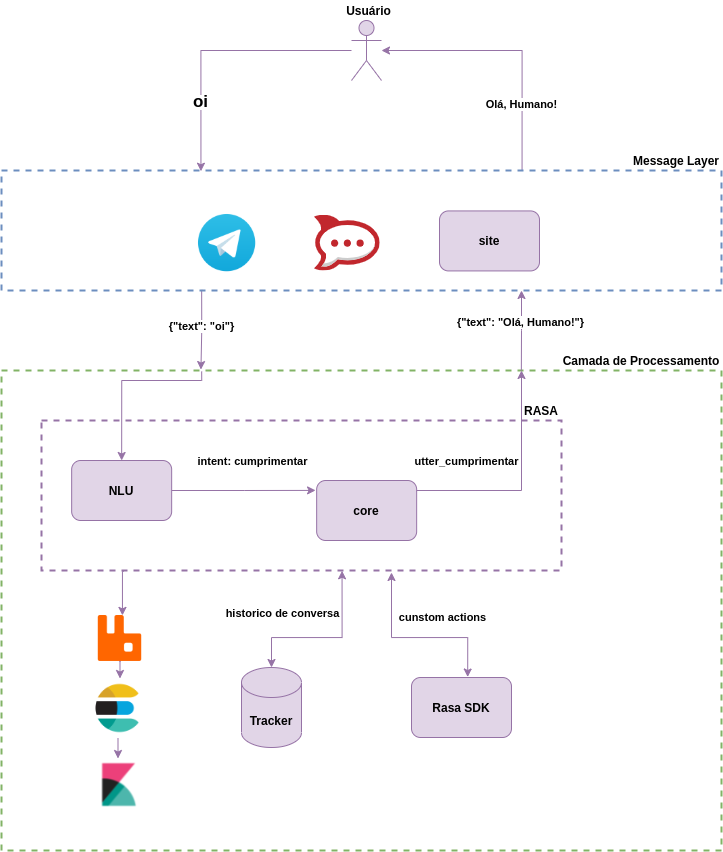

# Rasa Boilerplate
<!-- badges -->
<a href="https://www.gnu.org/licenses/gpl-3.0.pt-br.html"></a>
<a href="https://codeclimate.com/github/lappis-unb/rasa-ptbr-boilerplate/maintainability"></a>


_For English version: [README-en](docs/README-en.md)_


O boilerplate nasceu como uma abstração genérica do projeto [Tais](http://github.com/lappis-unb/tais). Hoje, tem o objetivo de tornar mais fácil a criação de um chatbot [Rasa](http://rasa.com/). Com a evolução do framework, atualmente o foco do boilerplate é uma documentação em código viva.

Aqui você pode encontrar um chatbot totalmente em Português Brasiliero que vai te auxiliar com exemplos de diálogo, código e uso de funcionalidades do Rasa.

## Arquitetura

A [arquitetura](https://drive.google.com/file/d/1xUojfFGrYubSfmd3tL77XzgZzD6cR-XH/view?usp=sharing) do boilerplate pode ser divida em 2 partes principais:

* **Criar**

Processo que transforma arquivos de configuração `.yml` em um `modelo treinado` que contẽm a inteligência do chatbot.


* **Prover**

O usuário interage com a Boilerplate via Telegram, que manda as mensagens para o Rasa NLU através de conectores, onde ele identifica a *intent*, e responde pelo Rasa Core, de acordo com as *stories* e *actions*.

As *models* utilizadas para a conversação foram geradas pelo módulo *trainer* e depois transferidas para o bot, estes modelos podem ser versionados e evoluídos entre bots.




## Tutorial

Primeiramente, clone o repositório para sua máquina local usando o comando:

```sh
git clone https://github.com/lappis-unb/rasa-ptbr-boilerplate.git
```

Para ter seu chatbot Rasa funcionando, certifique-se de estar dentro da pasta do projeto e então execute no terminal o seguinte comando:

```sh
make first-run
```

Esse comando irá construir a infraestrutura necessária (subir containers com as dependências, treinar o chatbot e iniciar o chat no modo shell) para possibilitar a interação com o chatbot.

Depois que tudo for instalado, você verá a seguinte mensagem e pode começar a interagir com o bot:

```sh
Bot loaded. Type a message and press enter (use '/stop' to exit):
Your input ->
```

Para fechar a interação com o bot é só digitar `ctrl+c`.


### Comandos

* O comando de treinamento é usado para criar os modelos necessários na conversação do bot. Para treinar o seu chatbot execute o comando:

```sh
make train
```

* Para executar o bot no terminal execute:

```sh
make shell
```

### Configuração Telegram

Após realizar o [tutorial](/docs/setup_telegram.md) de exportação de todas variávies de ambiente necessárias, é possível realizar a execução do bot no telegram corretamente.

**Antes de seguir adiante. Importante:** As variáveis de ambiente são necessárias para o correto funcionamento do bot, por isso não esqueça de exportá-las.

Depois execute o bot no telegram:

```sh
make telegram
```

### Analytics

Para a visualização dos dados da interação entre o usuário e o chatbot nós utilizamos uma parte da Stack do Elastic, composta pelo ElasticSearch e o Kibana. Com isso, utilizamos um broker para fazer a gerência de mensagens. Então conseguimos adicionar mensagens ao ElasticSearch independente do tipo de mensageiro que estamos utilizando.

* Para uma **configuração rápida** execute o seguinte comando:

```sh
make build-analytics
```

Espere até os serviço do *ElasticSearch* estar pronto, e execute o comando abaixo para configurar os índices:

```
make config-elastic
``` 

Espere até os serviço do *Kibana* estar pronto, e execute o comando abaixo para configurar os *dashboards*:

```
make config-kibana
``` 

O comando acima precisa ser executado apenas 1 vez e já vai deixar toda a infra de `analytics` pronta para o uso.

Acesse o **kibana** na url `locahost:5601`

Caso você deseje entender o processo de configuração da *stack* de *analytics*, veja a [explicação completa de analytics](docs/setup_analytics.md).

### Adicionando componentes customizados de treinamento

O Rasa permite a adição de módulos customizados no seu pipeline de processamento, aprenda mais [AQUI](https://blog.rasa.com/enhancing-rasa-nlu-with-custom-components/).

Existe aqui um exemplo de componente customizado que implementa Análise de Sentimentos.

Para utilizá-lo basta introduzir o componente `components.sentiment_analyzer.SentimentAnalyzer` ao arquivo `bot/config.yml`. Como no exemplo:

```yml
language : "pt

pipeline:
  - name: WhitespaceTokenizer
  - name: "components.sentiment_analyzer.SentimentAnalyzer"                                                                                        - name: RegexFeaturizer
```

Depois, como no exemplo do arquivo `bot/components/labels.yml`, adicione frases que correspondam à uma label(classificação ou sentimento).

Por último basta treinar o bot novamente, e a informação será armazenada na entidade `sentiment` caso o componente identifique um valor para essa entidade.


## Notebooks - Análise de dados

### Setup

Levante o container `notebooks`

```sh
make notebooks
```

Acesse o notebook em `localhost:8888`

## Documentação

A documentação do projeto pode ser executada localmente utilizando o [GitBook](https://www.gitbook.com/).
Para instalar o gitbook via npm, é preciso ter instalado no computador [Node.js e npm](https://docs.npmjs.com/downloading-and-installing-node-js-and-npm).


* Instale o [gitbook](https://til.secretgeek.net/gitbook/use_gitbook_locally.html):

```sh
npm install -g gitbook gitbook-cli
```

* Depois de instalado, na pasta raíz do projeto, execute:

```sh
gitbook build .
```

* E para rodar localmente execute:

```sh
gitbook serve .
```

* Acesse:

```
http://localhost:4000/
```

**Contribuição**: Para contribuir com a documentação do projeto leia [como contribuir para a documentação](docs/Tutoriais/tutorial-como-contribuir-com-documentacao.md)

# Como conseguir ajuda

Parte da documentação técnica do framework da Tais está disponível na
[wiki do repositório](https://github.com/lappis-unb/tais/wiki). Caso não encontre sua resposta, abra uma issue com a tag `duvida` que tentaremos responder o mais rápido possível.

Em caso de dúvidas em relação ao Rasa, veja o grupo [Telegram Rasa Stack Brasil](https://t.me/RasaBrasil), estamos lá também para ajudar.

Veja mais informações de contato em nosso site: https://lappis.rocks.

# Licença

Todo o framework do boilerplate é desenvolvido sob a licença
[GPL3](https://github.com/lappis-unb/rasa-ptbr-boilerplate/blob/master/LICENSE)

Veja a lista de dependências de licenças [aqui](https://libraries.io/github/lappis-unb/rasa-ptbr-boilerplate)
