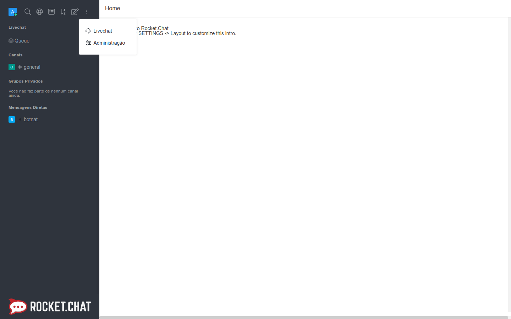
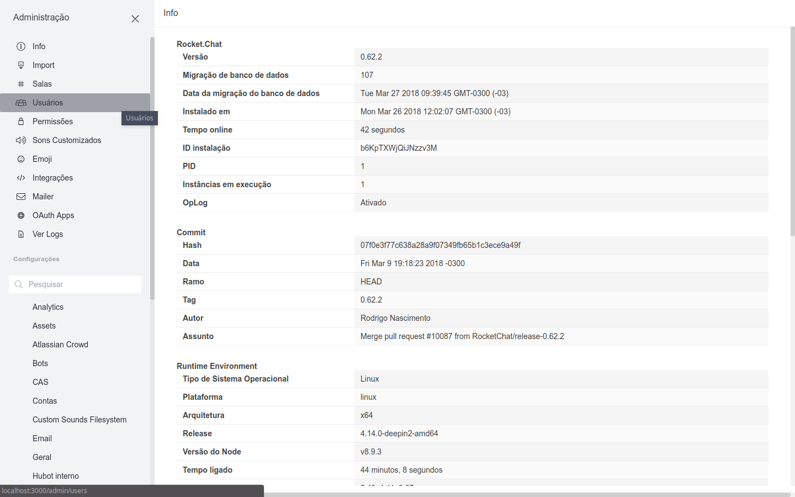
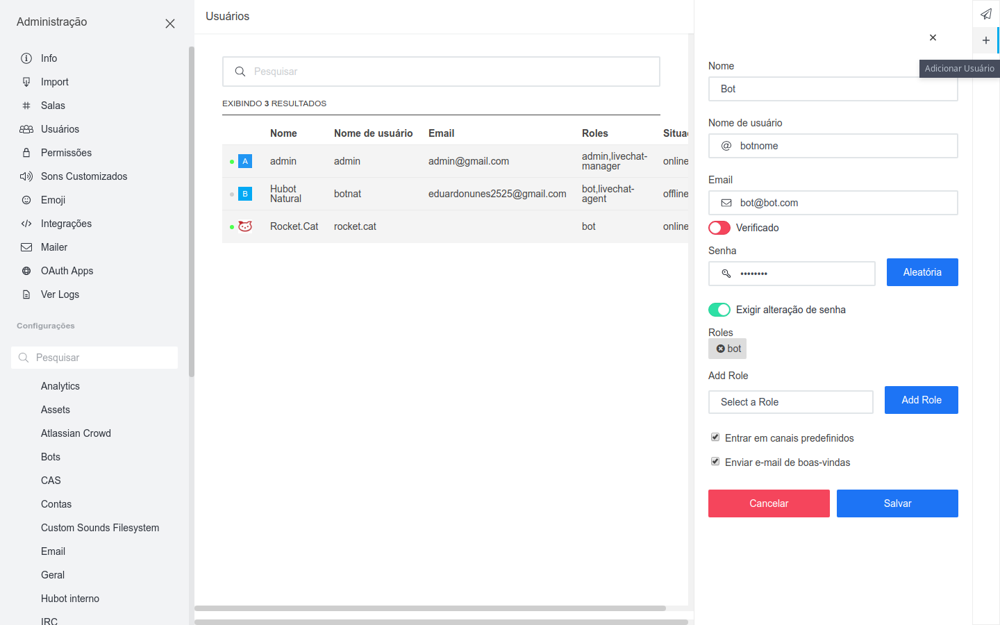
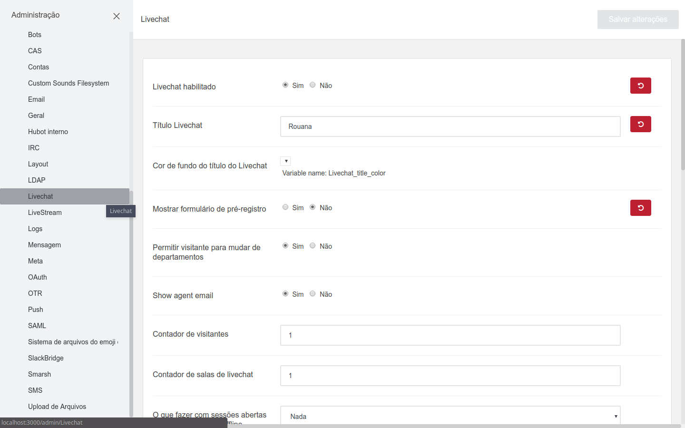
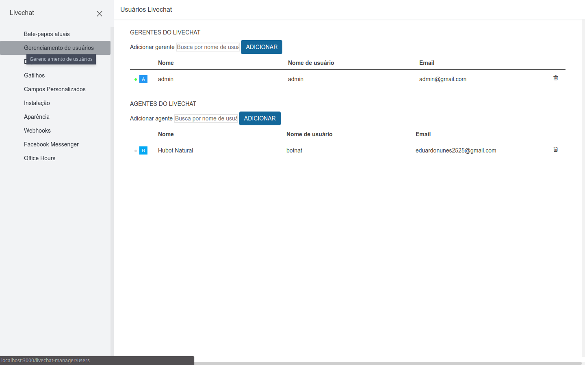
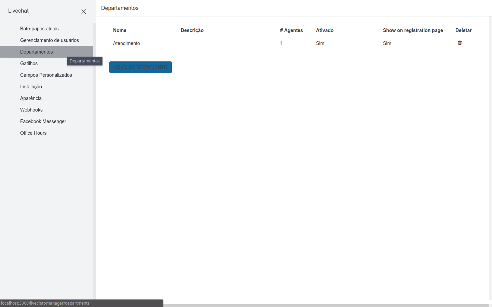
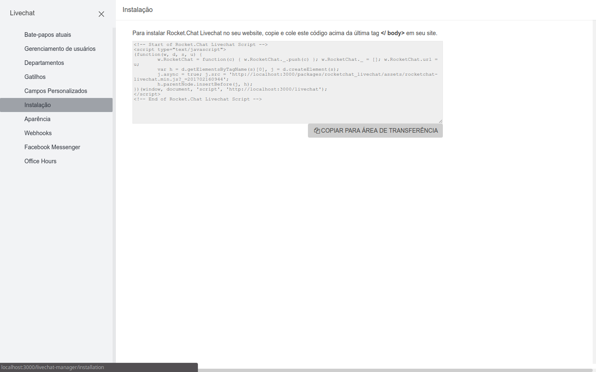
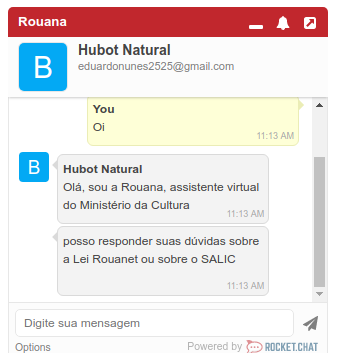

# Rouanet Bot

O Rouanet Bot é um projeto desenvolvido pelo LAPPIS (Laboratório Avançado de Produção, Pesquisa e Inovação em Software), da Universidade
de Brasília, em parceria com o Ministério da Cultura, para responder dúvidas dos usuários relacionadas à Lei Rouanet.
O projeto é desenvolvido com base no Rocket Chat, e nas ferramentas Rasa NLU e Rasa Core.

## Ambiente

Uma vez que você tenha instalado o [docker-compose](https://docs.docker.com/compose/install/), é possível executar o Rouanet Bot através dos seguintes comandos,
executados dentro da pasta do projeto:

```sh
docker-compose up -d mongo
```
```sh
docker-compose up -d mongo-init-replica
```
```sh
docker-compose up -d rocketchat
```

O Rocket Chat é executado na porta 3000, conforme definido no arquivo docker-compose.yml. Caso alguma dessas porta já estejam sendo utilizadas na sua máquina, altere a configuração neste arquivo.
Com as configurações padrões, acessando http://localhost:3000/ você terá acesso ao Rocket Chat.

## Adicionando o bot

Para adicionar o bot ao seu Rocket Chat, você deve criar uma conta de administrador. Após criar esta conta, você será direcionado a tela inicial do Rocket Chat, clique nos 3 pontos verticais no canto esquerdo superior, na qual terá a opção de **Administração**, selecione-a.



No menu lateral esquerdo, selecione a opção **Usuários**:



Logo em seguida, aparecerá uma barra lateral direita com uma opção com um +. Clique nesta opção e preencha as informações conforme a imagem a seguir. O nome do bot pode ser alterado, mas devem ser usados o usuário e senha que estão definidos nas variáveis `user` e `password` no arquivo `credential.yml`. Por padrão, o usuário e senha são, "rouana" e "rouanapass", respectivamente.

Para adicionar a role ao bot, clique na opção **Select a Role**, selecione bot e clique na opção ADD ROLE. Por fim, clique em *Salvar*.



Agora você já está apto a conversar com o bot diretamente, ou pelos canais usando @rouana antes da mensagem.

## Configurando o WebHook

É necessário configurar um WebHook de saída para redirecionar as mensagens do
chat para o servidor do Rasa Core. Para isso, vá em **Administração > Integrações > Nova integração > WebHook de Saída**.
Defina o **Trigger** do evento como sendo **Message Sent**.
Dentro da configuração do WebHook defina os campos da seguinte forma:

```
Event Trigger: Message Sent
Enabled: True
Channel: @rouana
URLs: http://rouana:5005/webhook
Post as: rouana
```

## Rodando o Bot

Para executar o bot é preciso configurar o arquivo `credentials.yml` com os dados correspondentes.
Depois disso, execute o container do bot:
```sh
docker-compose up -d rouana
```

### Livechat -  NEEDS UPDATE

O livechat permite que seja criada uma janela de conversa com o bot integrável à outras páginas. Para ativá-lo acesse novamente a opção 
**Administração**, clicando na seta para baixo, ao lado do nome da sua conta, no meu lateral esquerdo. Em seguida, clique na opção **Livechat**. Na tela seguinte, marque a opção **Livechat habilitado** como *Sim*, e a opção **Mostrar formulário de pré registro** como *Não*, para que não seja mostrado o formulário solicitando e-mail e senha no chat. Clique em *Salvar alterações*.



Feche o menu lateral esquerdo de administração e clique novamente nos 3 pontos do canto superior esquerdo, e desta vez clique na opção **Livechat**. No menu lateral esquerdo **Livechat**, selecione a opção **Gerenciamento de Usuários**. Você deve adicionar o bot como um agente, logo procure por bot, e em seguida clique em *ADICIONAR*.



Agora é necessário criar um departamento. No menu lateral esquerdo, clique em **Departamentos**, e em seguida em *NOVO DEPARTAMENTO*. Na tela seguinte, preencha um nome e uma descrição para o departamento e adicione o bot clicando no bot desejado em **Available agents**. Em seguida clique em **Save**.



No menu lateral esquerdo, clique em **Instalação**. Agora é só copiar o código exibido e colar no site o qual você deseja integrar a janela de conversa com o bot.



Após integrar o código ao seu site, uma janela semelhante a da imagem a seguir deve estar disponível.



